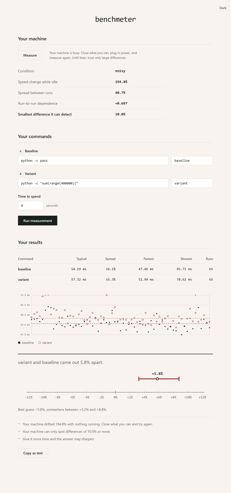
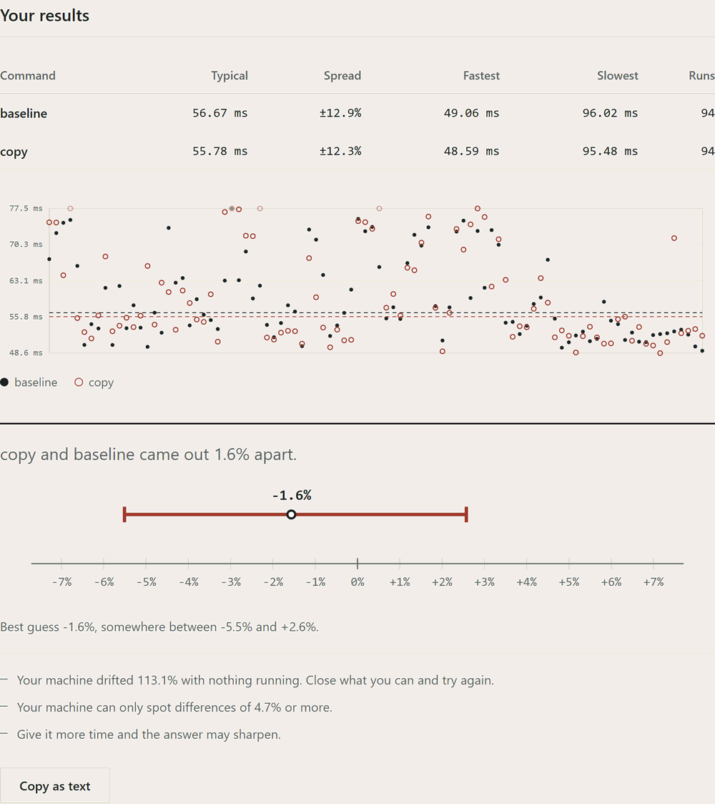
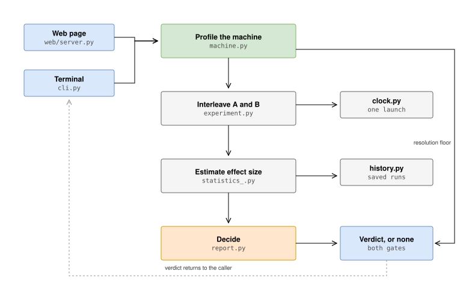
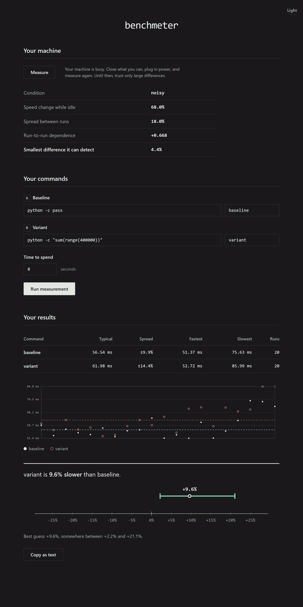

Tells you whether one command is really faster than another, or whether the difference is just noise.

Most of the time it is noise. Take a command, compare it against an exact copy of itself, and measure the usual way: all of A, then all of B, means compared with the standard error. On an ordinary laptop that will tell you the two are different most of the time. Same command, same machine.

Interleaving the two brings that down to almost nothing. And when the data still won't support an answer, this tells you so instead of picking a number anyway.



Type two commands, press the button. Runs on your own machine, nothing is uploaded.

```
python -m benchmeter.cli --web
```

Or double-click `launchers/benchmeter.cmd` on Windows, `launchers/benchmeter.sh` elsewhere. Python 3.9+, no dependencies.

## The two answers

Either one command is faster and you get the difference with an interval around it, or the evidence doesn't reach that far and you get told what is in the way: the machine is too unsettled, or there wasn't time for enough rounds.

Most tools only have the first answer. They print a number whatever the data looks like and leave you to act on it.



## Architecture



## How it works

**Interleaved rounds.** Each round runs both commands once, in shuffled order. Measure all of A and then all of B, and the machine warms up in between. That drift lands on B, and B gets blamed for it. Interleaving makes both share it.

**The median.** Timing distributions are right-skewed: a process can be delayed indefinitely but cannot finish faster than its instructions allow. The mean follows the long tail, the median doesn't.

**Bootstrap over pairs.** Round *i* of A and round *i* of B ran seconds apart under the same conditions. Resampling whole rounds keeps that pairing instead of mixing the two series.

**A noise floor.** A confidence interval describes the samples you collected and knows nothing about the machine drifting underneath them. I found this out the hard way: my own tool told me two identical commands were different, on a machine that was drifting far more than the difference it had just reported. The interval looked perfectly respectable. So the host gets profiled separately now, and a difference has to clear that resolution too.

The interleaving scheme is called RMIT in the literature and I did not invent it. What I added is the packaging and the second gate.

## Prove it yourself

```
python -m benchmeter.cli --self-proof
```

Times one task, splits the samples in half, then compares the halves against each other. Both halves came from the same task, so every "significant difference" it finds is a false positive, and it counts them. You get the sequential rate and the interleaved rate side by side.

It runs the same experiment in C too, because the first thing anyone says is "that's just the garbage collector". Source in `native/verify.c`. I walked into three compiler traps writing it, each of which silently timed nothing at all; they're in `native/README.md`.

## Check the machine

```
python -m benchmeter.cli --check-machine
```

A fixed workload runs over and over. Since the workload never changes, every variation you see is the machine and not the code. Out of that comes a floor: below it, nothing can be established on this host however long you measure.

## Options

```bash
python -m benchmeter.cli "a.py" "b.py" --label old --label new
python -m benchmeter.cli "a.py" "b.py" "c.py"     # more than two
python -m benchmeter.cli "a" "b" -t 60            # seconds
python -m benchmeter.cli "a" "b" --json
python -m benchmeter.cli "a" "b" --seed 42        # reproducible
python -m benchmeter.cli "a" "b" --save --note "before caching"
```

Exit codes: `0` difference found, `1` error, `2` no conclusion. The `0`/`2` split matters in CI. A failure then means performance regressed, not that the runner was busy.

Saved runs store the machine state too, so comparing across two different machine states says so rather than blaming the code.



## Tests

```
python -m unittest discover tests
```

The ones that matter are in `test_false_positives.py`, where the right answer is fixed before the test runs: samples from one distribution must never come back different, and a twofold difference must never be missed. Anything else counts as an error. A measurement tool that grades its own homework is not evidence of anything.

## What it won't do

It won't quiet your machine. I tried pinning to a core, raising priority, and turning off the garbage collector. Without admin rights Windows refuses the first two, and the third made things worse. So the tool profiles the machine instead and tells you what it found.

It's slower than counting instructions. `cachegrind` has near-zero variance, but it ignores branch prediction and instruction-level parallelism. Different question.

It runs what you give it. The server binds to loopback and rejects requests that didn't come from its own page, but it does execute the commands.

Whatever it reports on my laptop, yours will be different. Run `--self-proof` and you get your own.

## Where it came from

A first-year physics lab, where a measurement without an uncertainty is not a result, and you check what your instrument can actually resolve before you trust a reading off it.

## License

MIT.
